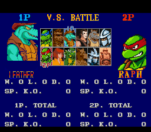
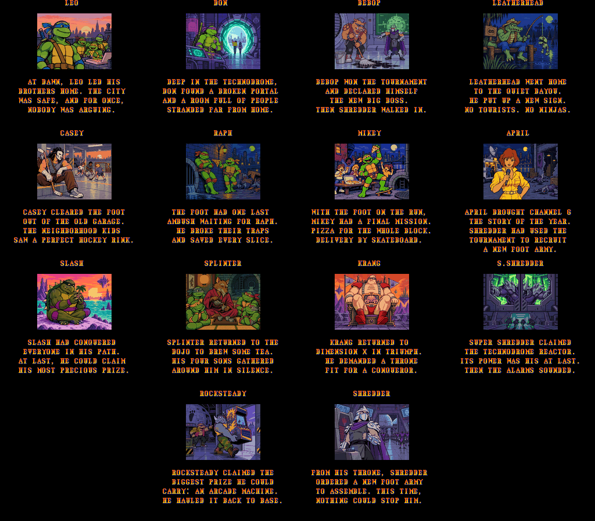
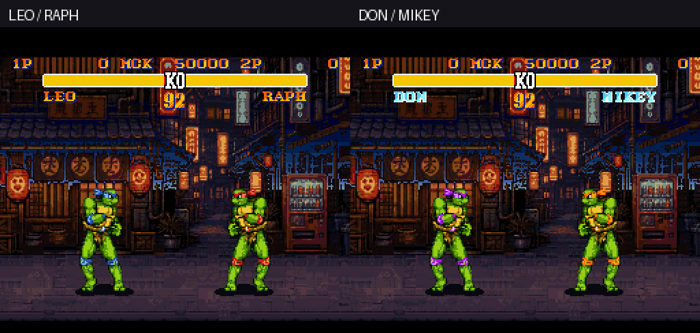
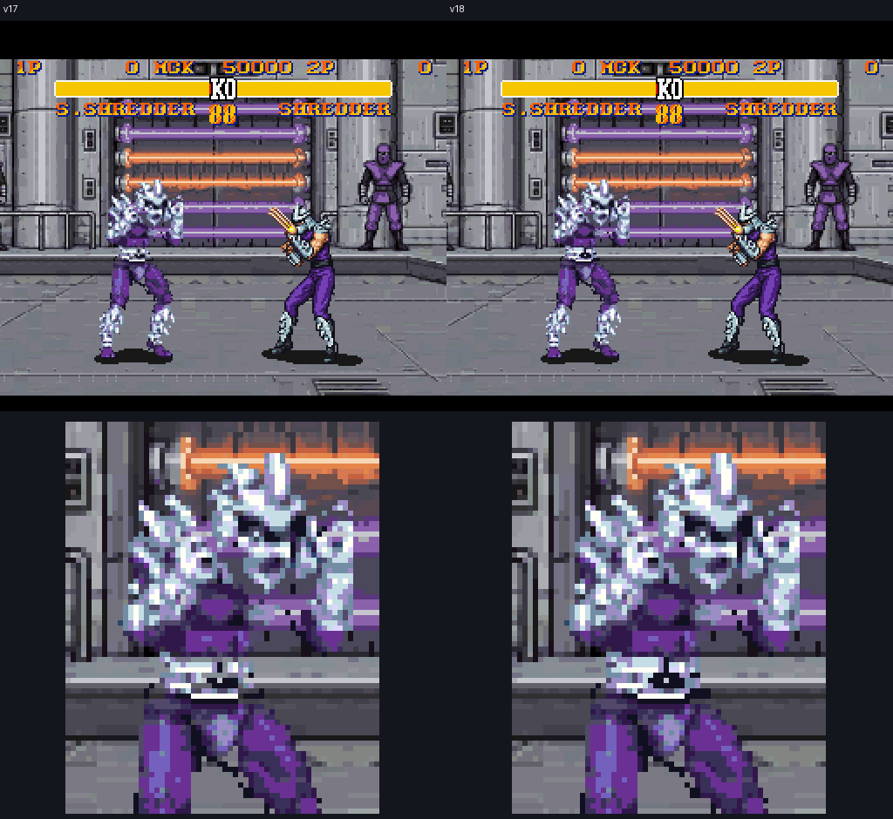

# TMNT × Street Fighter II Turbo

A fan-made visual overhaul of **Street Fighter II Turbo for SNES**: twelve TMNT
characters, eleven replaced backgrounds, and the original fighting moves underneath.
Built with Ryan's creative direction and Codex/Astra assistance on Linux.

**Current version: v25.** This repository distributes patches and tools.
You supply the matching original game; no complete game ROM is included.



## Play

1. Download this repository using **Code → Download ZIP**, then extract it.
2. Supply your own lawfully obtained **Street Fighter II Turbo, Europe/PAL,
   version 1.0** ROM. US, Japanese and other revisions are not supported.
3. With Python 3.9 or newer, run:

   ```bash
   python3 apply_patch.py "/path/to/original.smc" --out "TMNT-SFII-v25.sfc"
   ```

   On Windows, use `py -3` in place of `python3`.

4. Open the generated file in an SNES emulator. Start from a fresh boot;
   an older save state may retain outdated graphics or scrolling data.

The patcher runs locally on Linux, macOS or Windows. It checks the input
revision, patch checksums and final output hash, and refuses to overwrite
an existing file. It accepts the exact original (including the verified
512-byte-headered form) and v12 through v24 releases. Older releases are
validated through the v16 through v24 intermediates.
It never downloads a ROM or sends your file anywhere.

For a graphical patcher, the `.bps` files in `patches/` work with
[Floating IPS](https://github.com/Alcaro/Flips). The full patch expects a
**headerless** original; the included Python patcher also handles the
verified original with its 512-byte copier header.

## Roster

| Original fighter | Replacement |
| --- | --- |
| Ryu | Leonardo / Leo |
| Ken | Raphael / Raph |
| Chun-Li | April |
| E. Honda | Bebop |
| Guile | Casey Jones |
| Dhalsim | Splinter |
| Balrog, the boxer | Rocksteady |
| Vega, the claw fighter | Shredder |
| Sagat | Super Shredder |
| M. Bison, the dictator | Krang's android body |
| Blanka | Leatherhead |
| Zangief | Slash |

Leatherhead and Slash use their original-cartoon designs and retain Blanka's
and Zangief's moves. Leatherhead retains the original riverside stage with its
v20 night palette and backdrop. The design references the original
TMNT cartoon and the NES/SNES games. Leonardo has a tight Japanese night
backstreet; Shredder, Super Shredder and Krang have distinct Technodrome rooms.
The original cage and wall-jump mechanics remain on Shredder's stage. V18
includes the v14 icon-framing and v15 background-animation corrections.

## V25 — biography, pose, and ending-music repair

V25 repairs 204 pixels across Super Shredder walking poses 004/005 and patches all twelve native biography text packets with readable TMNT presentation text. Static packet checks cover all twelve biographies. A no-input Slash replay also matches two settled biography screens against its v2 reference; this is not a full biography or attract-mode audit.

The ending plays the original native music continuously for 36 full seconds, then fades before the stock ranking and title music. Fresh Turbo Leo and Normal Mikey Arcade campaigns each reached all twelve stages, three bonuses, ending pages 1–7, the native title, and the menu; they recorded 47 health-fixture KOs in total. The two audio receipts also confirm all fourteen ending initial pages and palettes remain v24-exact.

Voice resources, stage songs, turtle idle, and the existing title, map, and geography presentation are unchanged. Selective voice treatment awaits user approval; new stage music remains future work.

## V24 — subtle ending motion

V24 adds 14 localized environmental loops to the illustrated endings while preserving the accepted base art, stories, credits and gameplay. Each native 50.00698 fps loop runs for 1.20–1.92 seconds. The bounded runtime uses 272 bytes plus 13,120 bytes of motion data in existing space, with at most 16 tiles / 512 bytes scheduled per update. This is localized environmental motion, not full character cutscenes.

Release QA covered 14 identities across 98 native pages and 15,134 rendered frames. Both loops on every page completed with exact phase payloads; all CGRAM and all VRAM/pixels outside the localized effects match their corresponding v23 page. Fourteen Turbo and two Normal Don/Mikey cold-boot campaigns reached all twelve stages, three bonuses, pages 1–7, title and menu using 382 observed health-fixture KOs without forcing endings.

## V23 — endings, credits and Mikey raised-arm repair

Every fighter now has an illustrated TMNT ending, including separate stories for Don and Mikey: fourteen pictures, two story pages each, and a new five-card credits sequence. Pages advance automatically, or with a fresh Start press. The sequence returns to the title menu.

Mikey and Raph’s raised-arm victory pose also loads its missing graphics correctly. Original moves, damage and timing are preserved.

<details>
<summary>Preview the new endings (spoilers)</summary>



</details>

## V22 — costume-aware select and VS captions

**Release QA is complete.**

Gold select and VS captions now follow the chosen turtle costume: alternate Leo displays **DON** and alternate Raph displays **MIKEY**. Aggregate records use shared totals labeled LEO/DON and RAPH/MIKEY. The main labels remain LEO/RAPH. The palette, body art, portraits, icons, stages, OAM/DMA and move code are unchanged from v21.

## V21 — Don and Mikey alternates

Leonardo's alternate costume uses a bold Donatello-purple bandana and
Raphael's alternate uses a bold Michelangelo-orange bandana. Mode-aware palette
normalization preserves the usual blue/red primary costumes in Normal and Turbo;
all moves, hitboxes, graphics, OAM/DMA and stages remain unchanged.

**Confirm Leo with Start to play as Don, or Raph with Start to play as Mikey.**
An attack button selects the regular blue/red costume. Same-slot mirror matches
enforce different costumes, respecting the first confirmed selection.

Large portraits and defeated/continue portraits follow the costume. The battle
HUD and VS winner banners temporarily say **DON/MIKEY**. Select/VS bitmap
captions, aggregate records and other static names remain **LEO/RAPH** in this v21 history entry. [V22](docs/releases.md#v22--costume-aware-turtle-captions) later adds costume-aware select and VS captions.



## V20 stages and hockey-stick projectile

Slash uses the approved Dimension X scrapyard with its plain floor and original BG3 foreground fence. Leatherhead retains stage 2 with the v20 Brazil night palette, backdrop and navy sky. Casey now throws a taped hockey stick; release pose 37 auxiliary loads are repaired. Moves, hitboxes and gameplay are unchanged.

## V19 Splinter orientation

Splinter now faces his opponent while standing on either side. Existing art,
moves and timing are preserved.

## V18 cleanup

Seven select icons now use the full bust height, removing the empty bands
while preserving gray borders and opaque backgrounds. Super Shredder's four
affected waist poses are repaired without changing moves or animation timing.



## What is included

- Full original-to-v25 and direct v24-to-v25 BPS patches, plus patcher support
  for original/headered and v12–v24 inputs.
- Earlier BPS patches, including the historical v13 patches, remain available.
- A portable, hash-checked Python patcher and format-level tests.
- Standalone source for v13's scrolling repair and v15's stage-animation fix.
- Retained artwork masters and layout metadata in [art/v16](art/v16/README.md),
  plus the v17 [geometry review](art/v17/README.md).
- [Release history](docs/releases.md), [technical notes](docs/technical-notes.md),
  and [contribution guidance](CONTRIBUTING.md).

This is the public distribution and patch-tool repository. The complete
historical art-generation workspace and emulator development environment
are not packaged here. The v13 and v15 fix sources reproduce their respective
increments; the full playable reskin is reproducible by applying the full
patch to the verified original.

## Current limits

Super Shredder walking poses 004/005 have the v25 204-pixel waist repair, and all twelve native biography text packets use readable TMNT presentation text. Static packet checks cover all twelve. A no-input Slash replay also matches two settled biography screens against its v2 reference; this is not a full biography or attract-mode audit. The ending music runs for 36 full seconds and fades before stock ranking and title music.
Voices, stage songs and turtle idle remain unchanged. Selective voice treatment awaits user approval, and new stage music remains future work. Existing title, map and geography presentation is retained. V24's localized environmental motion remains limited to the illustrated endings rather than full character cutscenes.
See [verification](docs/verification.md) for measured coverage; testing uses
an emulator, rather than original-hardware certification.

## Rights and distribution

This is an unofficial fan project, not affiliated with or endorsed by the
Street Fighter or Teenage Mutant Ninja Turtles rights holders. Those
characters, names, original game material and trademarks remain the property
of their respective owners.

A patch avoids distributing the complete base game, but it can still contain
copyrighted or derivative material. Patch format and noncommercial status
do **not** establish permission or immunity from takedowns. No license to
third-party franchise or game content is granted here. The original Python
tooling is offered under the [MIT license](LICENSE); that license excludes
the patches, game artwork, screenshots and third-party content.

Background: [U.S. Copyright Office on derivative works](https://www.copyright.gov/eco/help-limitation.html)
and [GitHub's DMCA policy](https://docs.github.com/en/site-policy/content-removal-policies/dmca-takedown-policy).
Please do not upload ROMs, emulator save states, extracted original game
assets or ROM-download links in issues, pull requests or releases.
